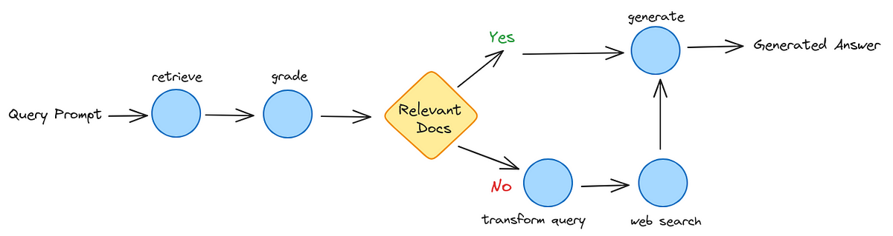

# Corrective RAG

This notebook demonstrates a self-correcting Retrieval-Augmented Generation (RAG) pipeline. It automatically improves retrieval quality by combining local document search with web search capabilities.

## 📖 Overview

This implementation showcases an advanced RAG system that goes beyond traditional retrieval by incorporating a **corrective mechanism**. When the initial document retrieval doesn't yield relevant results, the system automatically transforms the query and searches the web to provide comprehensive answers.

## 🎯 Key Features

### 🔄 **Self-Correcting Mechanism**
- **Initial Retrieval**: Searches local vector database for relevant documents
- **Relevance Grading**: LLM evaluates document relevance using intelligent scoring
- **Automatic Correction**: Poor retrievals trigger query transformation and web search
- **Enhanced Generation**: Combines all context sources for optimal answers

### 🏗️ **Architecture Highlights**
- **Workflow Orchestration**: LangGraph-based state management
- **Hybrid Search**: Local documents + web search integration
- **Intelligent Decision Making**: Dynamic routing based on content relevance
- **Robust Error Handling**: Graceful fallbacks and retry mechanisms

## 🛠️ Tech Stack

| Component | Technology | Purpose |
|-----------|------------|---------|
| **LLM** | Mistral API | Text generation and document grading |
| **Vector Database** | ChromaDB | Local document storage and retrieval |
| **Embeddings** | HuggingFace Transformers | Document vectorization |
| **Web Search** | RapidAPI Google Search | External knowledge retrieval |
| **Orchestration** | LangGraph | Workflow state management |
| **Document Processing** | LangChain | PDF/text loading and chunking |

## 🔄 How It Works

### Workflow Steps

1. **Document Retrieval**: Searches local vector database using similarity search
2. **Relevance Grading**: LLM evaluates each document's relevance to the query
3. **Decision Making**: Determines whether to proceed with generation or search the web
4. **Query Transformation**: Optimizes the query for better web search results
5. **Web Search**: Retrieves additional context from external sources
6. **Answer Generation**: Synthesizes all available information into a comprehensive response

**⭐ Star this repository if you find it helpful!**

*Built with ❤️ for the AI community*
